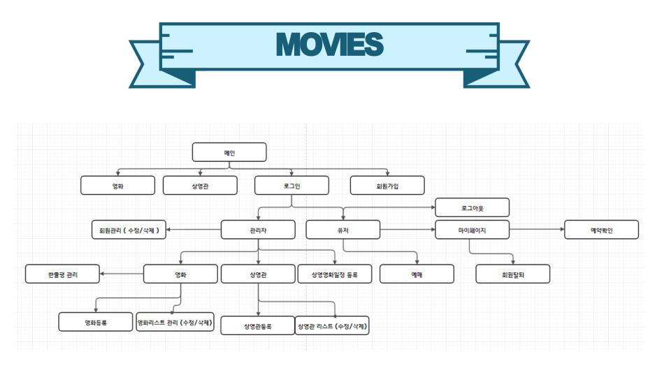

# MovieReservation
> Html5, Css3, Javascript, JQuery, Jsp, MySQL, Ajax 를 이용해 만든 영화예매 사이트

## 목차
* 회원관리(회원가입,로그인,로그아웃,회원탈퇴)
* 영화관리(영화등록, 삭제, 영화상세정보, 한줄평)
* 상영관 관리(상영관등록, 삭제, 수정, 상영관상세정보)
* 예매관리(예매정보등록, 티켓예매, 티켓취소)

## 기술 
* `HTML5`
* `CSS3`
* `Javascript`
* `jQuery`
* `JSP` 이용하여 내부 객체 속성으로 데이터 처리, `EL` + `JSTL`
* `MySQL`
* `MyBatis`
* `ajax` 비동기통신
* `XML`, `JSON` 파싱
* 서버 클라이언트 통신을 위한 `REST` 인터페이스 구현
* `Spring Framework`
* `FTP 업로드` 프로젝트 war파일을 네트워크를 통해 서버호스팅에 배포
* `Putty`

## 프로젝트 설명 PPT 
* 프로젝트 설명
* DB 설계
* 프로젝트 시 어려웠던 점
* 프로젝트 개선사항
* [LINK](https://docs.google.com/presentation/d/1OqB6CAFzpN5eqOsExiEoF5tlA7aEFvVGuz3cJXoYJ4M/edit#slide=id.p)

## 프로젝트 클라이언트 URL
* [LINK](http://13.209.47.16:8080/movies/main)

## 프로젝트 구조
* MoviesClient : 클라이언트 역할
* 그 외 폴더 : java 코드 (기능구현)

